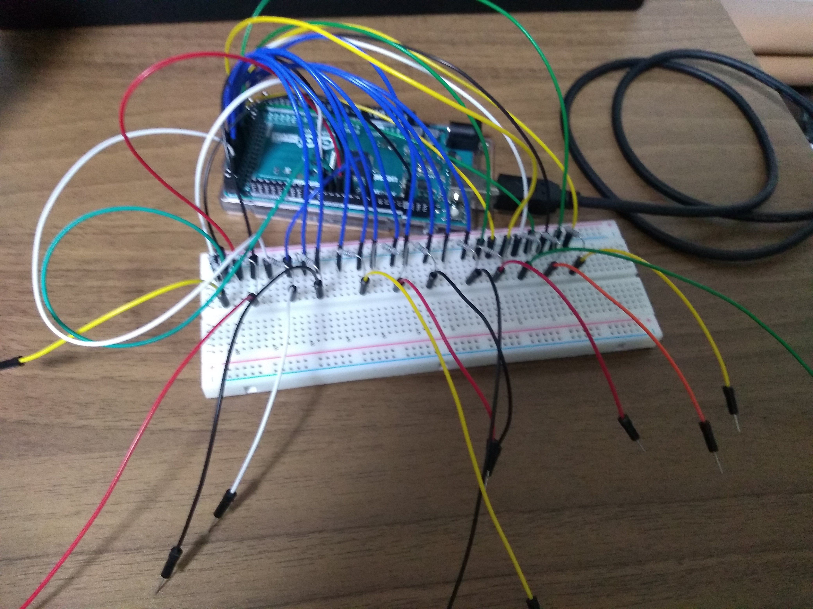

# Aruduino-Music-Box

## What Is This?
This is a touching piano using Arduino and Processing.

## Points!
1. A touch sensor is made using only a resistor and a jumper wire. The human body is the capacitor and works as a capacitance sensor.

{: align="center"}

1. Visualization of touched note keys with red circles using OpenGL via Processing.

{: align="center"}

1. Equipped with metronome function! Adjustable from 0 to 200 bpm with a dial.

{: align="center"}
